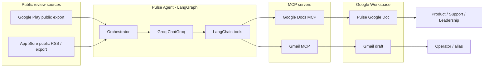
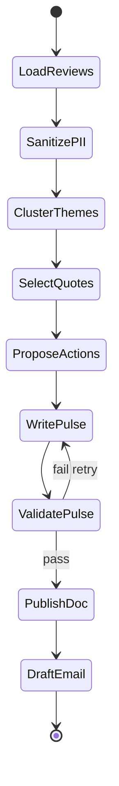
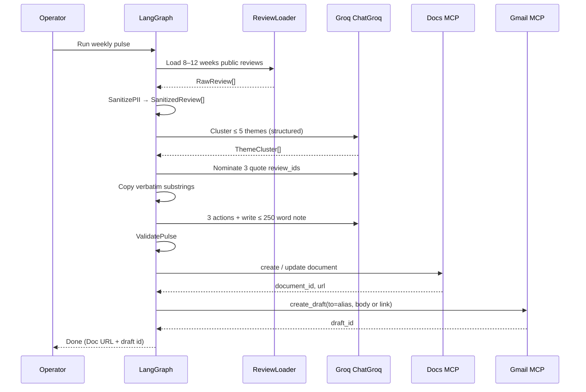

# Architecture: Groww Weekly Review Pulse

This document describes the system architecture for the Groww weekly review-pulse agent. It is derived from `Docs/problemStatement.md` and is the implementation blueprint for ingesting public store reviews, clustering them, writing a one-page pulse, publishing it to Google Docs, and creating a Gmail draft — all MCP-first for Google surfaces.

---

## 1. Purpose

Turn **8–12 weeks of public App Store and Play Store reviews** for Groww (`com.nextbillion.groww`, locale `en_IN`) into a **≤ 250-word weekly pulse** that Product, Support, and Leadership can scan in minutes.

The pulse must always contain:

| Block | Count | Rule |
| --- | --- | --- |
| Themes | Top 3 (from ≤ 5 clustered) | Grounded in review volume / rating signal |
| Quotes | 3 | Verbatim, anonymized, never invented |
| Action ideas | 3 | Concrete next steps tied to themes |

Delivery surfaces:

- **Google Docs** — canonical written pulse
- **Gmail** — draft to operator/alias containing the note or a Doc link

---

## 2. Architectural principles

1. **Agent-orchestrated pipeline, not a monolith.** Ingest, sanitize, cluster, write, publish, and notify are discrete stages with typed contracts.
2. **LangChain / LangGraph for the agent, Groq for the chat model.** Groq (`ChatGroq`) reasons over reviews; LangGraph owns the staged control flow.
3. **MCP-first for Google.** Docs and Gmail are reached only through MCP servers. No bespoke OAuth client or Google REST client in app code.
4. **Public reviews only.** No store-login scraping, no ToS-violating automation.
5. **Privacy by construction.** PII is stripped before any LLM call and never written to Docs, Gmail, logs, or caches.
6. **Deterministic artifacts, stochastic analysis.** Clustering and prose may use **Groq**; quotes must be copied from sanitized review text, not generated.

---

## 3. Why LangChain (decision)

**Yes — LangChain is the recommended application framework for this agent.**

This project is a **tool-using, multi-step LLM workflow** with structured outputs and two external MCP services. That is LangChain’s core design center.

| Need from the problem statement | LangChain / LangGraph capability |
| --- | --- |
| Multi-step flow: ingest → theme → Doc → Gmail draft | **LangGraph** state machine (`StateGraph`) with a linear pipeline plus retries |
| Cluster reviews into ≤ 5 themes; pick top 3 | Groq + **structured output** (Pydantic / JSON schema) |
| Select 3 verbatim quotes; never invent wording | Tool-bound quote picker that only copies from sanitized review IDs |
| Write a scannable ≤ 250-word note | Prompted generation with a word-count validator node |
| Google Docs + Gmail without custom REST/OAuth | **`langchain.mcp.MCPAdapter`** (or `langchain-mcp-adapters`) turns MCP tools into LangChain tools |
| Weekly, repeatable run | Graph invoked by a scheduler (`python -m`, cron, or LangGraph deployment) |
| Guardrails (PII, theme cap, quote fidelity) | Graph nodes + middleware; fail the run if validators reject the pulse |

### 3.1 Recommended stack split

| Layer | Library | Role |
| --- | --- | --- |
| Orchestration | **LangGraph** | Pipeline graph, state, retries, human-in-the-loop if MCP elicitation occurs |
| LLM / tools | **LangChain + langchain-groq** | `ChatGroq`, structured output, custom tools |
| MCP | **`langchain.mcp`** (`pip install "langchain[mcp]"`) | Bind Google Docs and Gmail MCP servers as tools |
| Schemas | **Pydantic v2** | Review, ThemeCluster, PulseNote, PublishResult |
| Ingest | Small Python modules (not MCP) | Public Play/App Store exports or official RSS |

LangGraph is used **with** LangChain, not instead of it. The agent is a LangGraph graph; Groq chat calls and MCP tools are LangChain objects.

### 3.2 What LangChain is *not* used for

- Google OAuth / Gmail REST / Docs REST (MCP servers own that)
- Store login or unofficial authenticated scrapers
- Storing reviewer identities
- The **OpenAI API** (`openai` Python package, `OPENAI_API_KEY`, `api.openai.com`)

---

## 4. System context



**Trust boundary:** the agent process may hold a local review export and a **Groq** API key (`GROQ_API_KEY`). Google credentials never live in this repo; they stay inside the Docs/Gmail MCP servers (or the host that runs those servers). OpenAI keys and `api.openai.com` are not used.

---

## 5. Logical architecture

Four layers. Each layer only talks to the one below it through typed interfaces.

```text
┌─────────────────────────────────────────────────────────────┐
│  Delivery                                                │
│  Google Doc (pulse) · Gmail draft (operator)             │
└──────────────────────────▲──────────────────────────────────┘
                           │ MCP tools only
┌──────────────────────────┴──────────────────────────────────┐
│  Agent runtime  (LangGraph + LangChain)                     │
│  ingest → sanitize → cluster → write → validate → publish   │
└──────────────────────────▲──────────────────────────────────┘
                           │ Pydantic models
┌──────────────────────────┴──────────────────────────────────┐
│  Domain services                                            │
│  ReviewLoader · PiiRedactor · ThemeClusterer · PulseWriter  │
│  QuoteSelector · ActionIdeator · PulseValidator             │
└──────────────────────────▲──────────────────────────────────┘
                           │ files / RSS / public APIs
┌──────────────────────────┴──────────────────────────────────┐
│  Data                                                       │
│  Public Play + App Store exports (8–12 weeks, en_IN)        │
└─────────────────────────────────────────────────────────────┘
```

---

## 6. Runtime: LangGraph pipeline

A **directed graph** is a better fit than a free-roaming ReAct agent. Theme caps, quote fidelity, word limit, and “draft not send” are invariants; a staged graph can enforce them. MCP Docs/Gmail calls remain **tools**, so the publish/notify nodes are still agentic where the MCP schema varies by server.



### 6.1 Graph state

The graph carries a single `PulseState` object (TypedDict or Pydantic). Downstream nodes never re-fetch raw reviews.

```text
PulseState
├── run_id: str
├── window: { start_date, end_date }          # ~8–12 weeks
├── product: { name, android_id, ios_id, locale }
├── reviews: list[SanitizedReview]            # after PII strip
├── clusters: list[ThemeCluster]              # ≤ 5
├── pulse: PulseNote | null                   # top 3 + 3 quotes + 3 actions
├── doc: { document_id, url } | null
├── email: { draft_id } | null
├── errors: list[str]
└── status: loading | ready | published | failed
```

### 6.2 Node responsibilities

| Node | Kind | Responsibility |
| --- | --- | --- |
| `LoadReviews` | Deterministic tool | Load Play + App Store public exports; filter to window and Groww IDs |
| `SanitizePII` | Deterministic | Strip usernames, emails, device IDs, phone numbers; assign opaque `review_id` |
| `ClusterThemes` | Groq LLM (structured) | Group into **at most 5** themes; attach counts, avg rating, example `review_id`s |
| `SelectQuotes` | Groq LLM + validator | Choose **3** quotes; validator asserts each string is a substring of a sanitized review |
| `ProposeActions` | Groq LLM (structured) | **3** concrete actions, each tagged to a theme |
| `WritePulse` | Groq LLM | One-page prose, ≤ 250 words, pulse template |
| `ValidatePulse` | Deterministic | Word count, 3/3/3 shape, no PII regex, quote substring check, theme ≤ 3 in the note |
| `PublishDoc` | MCP tool | Create or update the Google Doc |
| `DraftEmail` | MCP tool | Create a Gmail **draft** (never send unless a later requirement says so) |

On `ValidatePulse` failure: retry `WritePulse` up to N times with the validator error as feedback. After N failures, stop and do **not** publish.

---

## 7. Component design

### 7.1 Review ingestion

**Constraint:** public review exports only.

| Store | Allowed source | Identity |
| --- | --- | --- |
| Google Play | Operator-provided CSV/JSON export, or a library that reads **public** review listings | `com.nextbillion.groww`, `hl=en_IN` |
| Apple App Store | Official customer-reviews **RSS/JSON** feed, or a public export | Groww iOS app ID (configured, not hardcoded in prompts) |

Canonical review record after load (still may contain PII — sanitizer is next):

```text
RawReview
├── store: "play" | "app_store"
├── review_id_source: str          # store's id, not shown in outputs
├── rating: int                    # 1–5
├── title: str | null
├── text: str
├── date: date
└── locale: str                    # e.g. en_IN
```

Loader rules:

- Drop rows outside the 8–12 week window.
- Drop empty text.
- Do not keep reviewer display name, email, or device fields even if the export has them.
- Persist a local snapshot (`data/raw/`) for replay; this is optional and must be gitignored if it could contain PII.

### 7.2 PII redaction

Runs **before** any LLM prompt.

| Strip | Method |
| --- | --- |
| Emails | Regex |
| Phone numbers (IN / intl) | Regex |
| Usernames / author fields | Drop column; never send to LLM |
| Device IDs, GAID, IDFA | Regex + column drop |
| Remaining names in body | Conservative NER or pattern pass; replace with `[user]` |

Output: `SanitizedReview` with `review_id` = hash of store + source id (not reversible in artifacts). **Quotes in the pulse cite rating, store, and date only.**

### 7.3 Theme clustering

**Hard cap: 5 themes.** The written pulse uses the **top 3**.

Suggested Groww-oriented label space (data may replace these):

- Onboarding
- KYC / verification
- Payments / adding money
- Statements / reports
- Withdrawals / payouts

Implementation (LangChain structured output via **Groq** `ChatGroq`):

1. Embed or batch-summarize reviews if volume is high (optional `langchain-text-splitters` + batched map).
2. Ask the model to assign each review a theme key from a closed set **or** propose new keys until 5 exist, then map the rest into those 5.
3. Rank themes by `(volume, negative-rating weight)` so “what people care about” is not only chatter volume.
4. Return `ThemeCluster[]` with `name`, `review_ids`, `count`, `avg_rating`, `severity`.

Do **not** let the writer invent a 6th theme in the Doc.

### 7.4 Quote selection

The model **nominates** `review_id`s; a Python function **copies** `text`/`title` slices.

```text
Quote
├── review_id: str
├── text: str          # exact substring of SanitizedReview.text or title
├── rating: int
├── store: str
└── date: date
```

If the model returns wording that is not a substring, the node rejects and retries. This is how “no invented wording” is enforced in architecture, not only in the prompt.

### 7.5 Action ideas

Three items, each `{ title, rationale, theme, owner_hint }` where `owner_hint` is Product / Support / Growth — useful for the audience table in the problem statement. Actions must be implementable (e.g. “Clarify UPI add-money failure copy on the payments screen”), not slogans.

### 7.6 Pulse writer

Prompt includes:

- Window dates and product name
- Top 3 clusters (stats only + quote ids)
- The 3 locked quotes
- The 3 actions
- Hard limit: ≤ 250 words
- Template from the problem statement

Output is markdown/plain text ready for Docs MCP (`create` / `insert` / `update` depending on the server’s tools).

### 7.7 Validator

Fail closed if any check fails:

| Check | Pass condition |
| --- | --- |
| Shape | Exactly 3 themes, 3 quotes, 3 actions in the note |
| Length | Word count ≤ 250 |
| Quotes | Each quote text ⊆ some `SanitizedReview` |
| PII | No email/phone/username patterns in the note |
| Themes | Names ⊆ clustered set; clustered set length ≤ 5 |

---

## 8. MCP integration (Google Docs & Gmail)

### 8.1 Pattern

Application code **does not** call `docs.googleapis.com` or `gmail.googleapis.com`. It connects to MCP servers that already know how to authenticate.

LangChain 1.4+ ships this as `langchain.mcp.MCPAdapter` (`pip install "langchain[mcp]"`). Older setups use `langchain-mcp-adapters.MultiServerMCPClient`. Both expose MCP tools as LangChain tools for `create_agent` or graph `ToolNode`s.

```text
Pulse graph
    └─ PublishDoc / DraftEmail nodes
           └─ MCPAdapter
                  ├─ google-docs MCP  → create/update document
                  └─ gmail MCP        → drafts.create
```

Illustrative wiring (tool names follow whatever the chosen MCP servers expose):

```python
from langchain.mcp import MCPAdapter
from langchain.agents import create_agent

mcp_config = {
    "google-docs": {"command": "...", "args": [...], "transport": "stdio"},
    "gmail": {"command": "...", "args": [...], "transport": "stdio"},
}

async with MCPAdapter(mcp_config) as adapter:
    tools = await adapter.list_tools
    # pass `tools` into PublishDoc / DraftEmail nodes or create_agent(...)
```

Use the Docs and Gmail MCP servers **available in the runtime** (Cursor, Claude Desktop, course lab, or a local stdio process). The architecture requires the **MCP-first path**, not a specific vendor package name.

### 8.2 Expected tool intents

Exact tool names vary by server. The agent binds by capability:

| Intent | Typical MCP operation | Graph node |
| --- | --- | --- |
| Create pulse Doc | `docs.create` / `create_document` | `PublishDoc` |
| Write body | `docs.insert_text` / `update_document` | `PublishDoc` |
| Return link | document id + URL in tool result | stored on `PulseState.doc` |
| Create draft | `gmail.create_draft` / `create_draft` | `DraftEmail` |
| Recipient | operator email or alias from config | `DraftEmail` |

**Gmail: draft only.** Do not call send tools.

### 8.3 Auth

- MCP servers hold Google OAuth / Workspace tokens.
- This repo stores only `OPERATOR_EMAIL`, product IDs, date window, and `GROQ_API_KEY`.
- If the MCP spec returns **elicitation** (re-auth, confirm), LangGraph interrupts surface it to the operator; the graph resumes after approval.

### 8.4 Publish / notify payload

**Google Doc title:** `Groww Weekly Review Pulse — {start} to {end}`

**Gmail draft:**

- To: operator or alias
- Subject: same as Doc title
- Body: full pulse text **or** one-paragraph summary + Doc URL (problem statement allows either)

---

## 9. End-to-end sequence



---

## 10. Target repository layout

```text
App Reviews/
├── Docs/
│   ├── problemStatement.md      # product brief (source of truth for "what")
│   └── architecture.md          # this file ("how")
├── src/
│   └── pulse/
│       ├── graph.py             # LangGraph StateGraph
│       ├── state.py             # PulseState
│       ├── schemas.py           # Pydantic models
│       ├── llm.py               # ChatGroq factory (GROQ_API_KEY)
│       ├── prompts.py
│       ├── ingest/
│       │   ├── play_store.py
│       │   └── app_store.py
│       ├── privacy.py           # PII redaction
│       ├── cluster.py
│       ├── quotes.py            # substring-locked selection
│       ├── validate.py
│       └── mcp_tools.py         # MCPAdapter wiring
├── data/
│   ├── raw/                     # gitignored exports
│   └── snapshots/               # optional sanitized run dumps
├── config/
│   └── product.yaml             # Groww IDs, locale, window, alias, Groq model
├── tests/
│   ├── test_privacy.py
│   ├── test_validate.py
│   └── test_quotes.py
├── pyproject.toml
└── .env.example                 # GROQ_API_KEY only; no OpenAI or Google tokens
```

---

## 11. Configuration

| Key | Example | Notes |
| --- | --- | --- |
| `product.name` | Groww | |
| `product.play_id` | `com.nextbillion.groww` | |
| `product.play_hl` | `en_IN` | |
| `product.app_store_id` | (config) | iOS numeric id for RSS |
| `window.weeks` | 8–12 | Inclusive lookback |
| `limits.max_themes` | 5 | |
| `limits.pulse_themes` | 3 | |
| `limits.quotes` | 3 | |
| `limits.actions` | 3 | |
| `limits.max_words` | 250 | |
| `operator.email` | alias | Gmail draft recipient |
| `llm.provider` | `groq` | Only Groq Cloud; reject other providers |
| `llm.model` | `qwen/qwen3.6-27b` | Groq catalog id (`ChatGroq`); override with `PULSE_LLM_MODEL` |
| `mcp.docs` / `mcp.gmail` | stdio or URL | Environment-provided servers |

---

## 12. Technology choices

| Concern | Choice | Rationale |
| --- | --- | --- |
| Language | Python 3.11+ | Best LangChain / MCP / Pydantic support |
| Agent | LangGraph + LangChain | Staged invariants + tool calling |
| MCP client | `langchain.mcp.MCPAdapter` | First-party; Docs + Gmail as tools |
| LLM | **Groq** (`langchain-groq`, `ChatGroq`) | Structured clustering and pulse prose; default `qwen/qwen3.6-27b` |
| Review IO | CSV/JSON + App Store RSS | Public, replayable, ToS-safe |
| Tests | pytest | Validators and quote locking are unit-testable without Groq |
| Secrets | env / secret store | `GROQ_API_KEY` only in the app; never `OPENAI_API_KEY` |

---

## 13. Failure modes and recovery

| Failure | Handling |
| --- | --- |
| Empty or stale export | Fail `LoadReviews` with a clear error; do not invent reviews |
| All reviews empty after sanitize | Fail; no pulse |
| Model returns 6+ themes | Truncate/reject in `ClusterThemes`; retry with cap in the prompt |
| Invented quote | `SelectQuotes` / `ValidatePulse` reject; retry |
| Pulse > 250 words | Retry `WritePulse` with count feedback |
| MCP Docs auth elicitation | LangGraph interrupt; operator completes auth; resume |
| MCP Gmail tool missing | Fail `DraftEmail`; Doc may already exist — report both statuses |
| MCP send-mail tool offered | Allow-list tools; never bind send |

Idempotency: reuse a Doc titled for the same week window (update in place) so reruns do not spawn duplicate pulses. Gmail drafts may duplicate; that is acceptable for a draft-to-self workflow.

---

## 14. Privacy and compliance map

| Artifact | PII allowed? |
| --- | --- |
| `data/raw/` | Avoid; gitignore; delete after sanitize if possible |
| LLM prompts | Sanitized reviews only (Groq) |
| Google Doc | No usernames, emails, device IDs |
| Gmail draft | Same as Doc |
| Logs | `review_id` hashes only |

Quotes attribution format: `“…” (4★, Play Store, 2026-08-12)` — never an author name.

---

## 15. Mapping to success criteria

| Success criterion | Architecture element |
| --- | --- |
| Import ~8–12 weeks of public reviews | `LoadReviews` + Play/App Store adapters |
| Cluster ≤ 5 themes | `ClusterThemes` + schema cap |
| Top 3 themes, 3 quotes, 3 actions | `WritePulse` + `ValidatePulse` |
| ≤ 250 words, scannable, no PII | `SanitizePII` + `ValidatePulse` |
| Pulse in Google Docs via MCP | `PublishDoc` + Docs MCP |
| Gmail draft via MCP | `DraftEmail` + Gmail MCP (draft only) |

---

## 16. Out of scope

- Direct Google API clients as the primary Docs/Gmail path
- Sending the Gmail message (draft is enough)
- Authenticated Play Console / App Store Connect APIs
- More than five themes, or quotes that are paraphrases
- Dashboards, Slack bots, or extra delivery channels beyond Docs + Gmail draft
- OpenAI, Anthropic, or Google Gemini as the pulse LLM — **Groq only**

---

## 17. Source

Canonical product requirements: `Docs/problemStatement.md`.
This architecture is the implementation contract for the LangChain / LangGraph agent and MCP-first Google delivery path.
