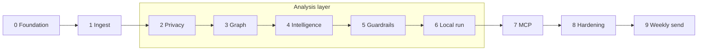

# Implementation Plan: Groww Weekly Review Pulse

Phase-wise plan to build the LangChain / LangGraph agent described in `Docs/architecture.md`, satisfying every success criterion in `Docs/problemStatement.md`.

Work is sequential: a phase does not start until the previous phase’s **exit criteria** are met. Intelligence nodes call **Groq** (`langchain-groq`); quote locking, PII, and validators must still pass without trusting the model. Do not add an OpenAI client.

---

## Outcome this plan delivers

A runnable weekly pipeline that:

1. Loads **8–12 weeks** of **public** Play Store + App Store reviews for Groww (`com.nextbillion.groww`, `en_IN`)
2. **Analysis layer:** strips **PII**, clusters the **live export** into **≤ 5** themes (trading tools, charges, execution, support, stability — not unused example labels), writes a **≤ 250-word** pulse with **top 3 themes, 3 verbatim quotes, 3 actions**
3. Publishes the pulse to **Google Docs via MCP**
4. Creates a **Gmail message to `operator.email` via MCP** (draft by default; **send** on the Monday job, CLI `--send`, or the localhost UI)

---

## Phase map

```text
Phase 0  Foundation          repo, config, schemas
Phase 1  Ingest              public Play + App Store loaders
──────── Analysis layer (Phases 2–6) ────────
Phase 2  Privacy             PII redaction before any LLM call
Phase 3  Graph skeleton      LangGraph state + empty nodes
Phase 4  Intelligence        cluster → quotes → actions → write
Phase 5  Guardrails          validator + retry loop
──────── Scheduler (instructor addendum) ────────
         Weekly Monday 09:00 IST fetch → classify → Doc → send
Phase 6  Local pulse run     end-to-end file output (no Google yet)
──────── Delivery (Phases 7–9) ────────
Phase 7  MCP delivery        Docs publish + Gmail draft
Phase 8  Hardening           E2E, idempotency, definition of done
Phase 9  Weekly send         operator send via this project's Gmail plugin
```



---

## Success-criteria traceability

| Problem-statement criterion | First phase that implements it | Phase that proves it |
| --- | --- | --- |
| Import ~8–12 weeks public reviews | 1 | 6 |
| Cluster ≤ 5 **data-backed** themes | 4 | 5–6 |
| Top 3 themes, 3 quotes, 3 actions | 4 | 5–6 |
| ≤ 250 words, scannable, no PII (incl. RSS author) | 2 + 5 | 6 |
| Google Docs via MCP | 7 | 8 |
| Gmail draft via MCP | 7 | 8 |
| Operator send + Monday 09:00 IST scheduler | 9 | 9 |

---

## Phase 0 — Foundation

**Goal:** Empty but correct project: Python package, config, Pydantic contracts, secrets pattern.

### Tasks

1. Create the layout from architecture §10 (`src/pulse`, `config`, `data`, `tests`).
2. Add `pyproject.toml` with Python 3.11+, `langchain`, `langchain-groq`, `langgraph`, `langchain[mcp]`, `pydantic`, `pyyaml`, `pytest`.
3. Add `config/product.yaml`:
   - `product.name`: Groww
   - `product.play_id`: `com.nextbillion.groww`
   - `product.play_hl`: `en_IN`
   - `product.app_store_id`: placeholder until Phase 1
   - `window.weeks`: `10` (within 8–12)
   - `limits`: max_themes 5, pulse_themes 3, quotes 3, actions 3, max_words 250
   - `operator.email`: alias placeholder
   - `llm.provider`: `groq` (only)
   - `llm.model`: Groq catalog id (default `qwen/qwen3.6-27b`)
4. Add `.env.example` with `GROQ_API_KEY` only (no OpenAI or Google tokens).
5. Gitignore `data/raw/`, `.env`, `__pycache__/`.
6. Implement Pydantic models in `src/pulse/schemas.py`:
   - `RawReview`, `SanitizedReview`, `ThemeCluster`, `Quote`, `ActionIdea`, `PulseNote`, `PublishResult`
7. Implement `PulseState` in `src/pulse/state.py` (architecture §6.1).
8. Config loader: YAML + env overrides. Reject non-Groq `llm.model` prefixes (`openai:`, `anthropic:`, …).
9. `src/pulse/llm.py`: `groq_chat_model(config)` factory (`ChatGroq`, `GROQ_API_KEY`).

### Files

| Create | Purpose |
| --- | --- |
| `pyproject.toml` | Dependencies and package |
| `config/product.yaml` | Groww IDs and limits |
| `.env.example` | Groq API key template |
| `.gitignore` | Raw data and secrets |
| `src/pulse/schemas.py` | Domain contracts |
| `src/pulse/state.py` | Graph state |
| `src/pulse/config.py` | Load product.yaml |
| `src/pulse/llm.py` | Groq `ChatGroq` factory |
| `tests/test_schemas.py` | Model round-trip |

### Exit criteria

- [ ] `pip install -e .` succeeds
- [ ] Config loads Groww Play ID, Groq `llm.provider`/`llm.model`, and all numeric limits
- [ ] Schema tests pass; `PulseNote` cannot be constructed with 4 quotes without a validation error (or an explicit validator exists to add in Phase 5)

### Out of scope this phase

LLM calls (Groq only), store IO, MCP.

---

## Phase 1 — Public review ingest

**Goal:** Load 8–12 weeks of Groww reviews from **public exports only** into `RawReview[]`.

### Tasks

1. Confirm Groww iOS app ID for the official App Store customer-reviews RSS; put it in `product.yaml`.
2. `src/pulse/ingest/play_store.py`:
   - Primary: read operator CSV/JSON export (rating, title, text, date).
   - Optional: public listing helper **only if** it does not require store login or ToS-violating automation.
   - Filter `com.nextbillion.groww`, locale `en_IN`, date window.
3. `src/pulse/ingest/app_store.py`:
   - Official RSS/JSON feed (or a saved public export).
   - Same window and field mapping.
4. Shared `load_reviews(window) -> list[RawReview]`:
   - Drop empty text.
   - Drop author/email/device columns at parse time (do not map them onto `RawReview`).
   - Merge Play + App Store; tag `store`.
5. CLI or function: `pulse ingest --out data/raw/` (directory gitignored).
6. Fixture: small anonymized sample under `tests/fixtures/` (no real PII) covering both stores and the date window.

### Files

| Create | Purpose |
| --- | --- |
| `src/pulse/ingest/play_store.py` | Play public export |
| `src/pulse/ingest/app_store.py` | App Store RSS/export |
| `src/pulse/ingest/__init__.py` | `load_reviews` |
| `tests/fixtures/reviews_sample.json` | Deterministic tests |
| `tests/test_ingest.py` | Window, empty-text, store tag |

### Exit criteria

- [ ] Sample fixture yields reviews with `rating`, `title`/`text`, `date`, `store`
- [ ] Reviews outside the window are excluded
- [ ] Empty bodies are dropped
- [ ] No author/username field exists on `RawReview`
- [ ] Documented how the operator drops a Play CSV into `data/raw/`

### Stop if

The only way to get Play data would be logged-in scraping — do not implement that. Keep CSV/JSON export as the Play path.

---

## Analysis layer — Phases 2–6

**Goal:** Turn Phase 1’s quality-filtered public reviews into a validated `PulseNote` **before** any Google MCP call.

This layer is not a generic brokerage template. It is grounded in the **current exports**:

| Input | Role in analysis |
| --- | --- |
| `data/raw/play_reviews.json` | Primary corpus (~1340 rows, ~2026-07-11 → 2026-09-04, English, ≥ 8 words, ~45% 1–2★) |
| `data/raw/app_store_reviews.json` | iOS supplement (~127 rows). Official RSS for id `1404871703` is **recent-only** (this pull ~2026-08-26 → 2026-09-04, mostly 5★ UI praise) — not a full 8–12 week iOS history |
| `tests/fixtures/app_store_rss.json` | Contract for RSS shape: first `feed.entry` is **app metadata** (no `im:rating` — drop); review entries carry `author.name`, `im:rating`, `title`, `content`, `id`, `updated` |

**What the live Play export actually talks about** (keyword signal for seed design, not pulse copy):

| Observed signal | Approx hits | Of which 1–2★ | Implication |
| --- | --- | --- | --- |
| Orders / execution | ~205 | ~119 | Must be a cluster candidate |
| UI / “easy to use” | ~203 | ~39 | High volume, mostly praise — do not let it bury 1★ themes |
| Charts / scalper / GTT / option chain | ~165 | ~80 | Trading-tool UX is a top complaint |
| Brokerage / charges | ~163 | ~100 | Pricing is a top complaint |
| Support / chat | ~141 | ~115 | High severity |
| Crash / freeze / glitch | ~113 | ~70 | Stability / bad updates |
| Withdrawals | ~53 | ~37 | Keep as optional fold-in, not a forced seed |
| Payments / UPI | ~40 | ~28 | Same |
| KYC / ReKYC | ~15 | ~12 | Low volume, **high severity** — ranking must still surface it |
| Statements / P&L | ~15 | ~8 | Do **not** force the problem-statement example labels |
| Onboarding | ~7 | ~3 | Same |

Problem-statement examples (onboarding, KYC, payments, statements, withdrawals) remain **allowed labels** when the data supports them. They are **not** the closed set for this corpus.

**RSS-specific facts the layer must handle** (from `app_store_rss.json` + live iOS export):

- `author` / `author.name.label` is present on RSS reviews and must never reach the LLM or pulse.
- iOS `title` is user-supplied and is often a **person’s name** (e.g. first+last) or a one-word label — not a theme. Quote from `text`, not from name-like titles.
- iTunes `id` is a public numeric string (e.g. `14506744466`); artifacts expose only `review_id` = hash(store + source id).
- RSS `content` can contain mojibake / curly-quote corruption; repair deterministically **before** clustering; quotes still copy the sanitized substring.
- The RSS fixture alone is **one** review — analysis tests must combine it with Play fixtures; never expect 3 quotes from RSS-only.

Downstream rule: every analysis node (`ClusterThemes` onward) accepts **only** `SanitizedReview[]`.

---

## Phase 2 — Privacy by construction

**Goal:** No PII reaches the LLM, the Doc, or the email. Sanitizer is deterministic and unit-tested. Input is Phase 1 `RawReview[]` (Play JSON + RSS-flattened App Store), which already dropped empty/short/non-English rows and author **columns** — residual PII still lives **in title/text**.

### Tasks

1. `src/pulse/privacy.py`:
   - Strip emails, IN/intl phones, device IDs (GAID/IDFA-like tokens).
   - Drop any residual author fields if a raw RSS object is passed through (fixture `author.name.label` = `ios.user`).
   - Replace likely **person names in `title` and `text`** with `[user]` (conservative). Allow-list product terms: Groww, KYC, UPI, IPO, GTT, PAN, Aadhaar, TradingView.
   - iOS name-like **titles**: if the title looks like a personal name and the body already has content, set `title` to `null` (do not quote “Pradeep Sholapurkar”).
   - Do not redact Groww feature words or competitor product names used as comparison (`5paisa`, Zerodha) unless they are clearly a person.
   - Deterministic encoding cleanup (mojibake / `Ã` sequences) on title+text so the LLM and quotes see readable English.
   - Assign `review_id` = hash(store + source id); never persist or log iTunes ids or Play `review_id_source`.
2. Output `SanitizedReview` (text, title, rating, store, date, review_id).
3. Quote attribution helper: `(2★, App Store, 2026-07-20)` — never a name, never a store id. RSS fixture date is IST-aware (`2026-07-20T10:15:00+05:30`).
4. Tests (no LLM):
   - `tests/fixtures/app_store_rss.json`: after flatten+sanitize, `author` is absent; `review_id` ≠ `ios-rss-1`; body still contains “e-KYC camera”.
   - Planted email/phone/username/device in Play rows.
   - Name-like iOS title redacted; feature title like `KYC on iPhone` kept.
   - Support-agent name inside a Play body becomes `[user]`.
5. Rule: `ClusterThemes` and later nodes accept **only** `SanitizedReview[]`.

### Files

| Create | Purpose |
| --- | --- |
| `src/pulse/privacy.py` | Redaction, title-name handling, hash, encoding cleanup |
| `tests/test_privacy.py` | PII + RSS-author + name-title cases |
| `tests/fixtures/reviews_pii_planted.json` | Fake email/phone/device (eval.md) |

### Exit criteria

- [ ] RSS fixture review sanitizes without `author` / `ios.user` / raw `ios-rss-1` in `SanitizedReview`
- [ ] Name-like App Store titles are not kept as quote-able titles
- [ ] Fixture with planted email/phone/username produces clean `SanitizedReview` text
- [ ] `review_id` is opaque (not the store’s raw id)
- [ ] Attribution format has no author field
- [ ] `tests/test_privacy.py` passes without an LLM

---

## Phase 3 — LangGraph skeleton

**Goal:** Runnable graph with all nodes stubbed; state flows; no real LLM yet. Analysis nodes see only sanitized reviews from both stores.

### Tasks

1. `src/pulse/graph.py`: `StateGraph` with nodes from architecture §6.2:
   `LoadReviews → SanitizePII → ClusterThemes → SelectQuotes → ProposeActions → WritePulse → ValidatePulse → PublishDoc → DraftEmail`
2. Stub each node: pass-through or `NotImplemented` with a clear status update.
3. `LoadReviews` and `SanitizePII` wired to Phase 1–2 implementations (first real nodes).
   - Load Play `data/raw/play_reviews.json` + App Store `data/raw/app_store_reviews.json` when present.
   - Tests use `tests/fixtures/app_store_rss.json` **plus** Play sample rows — RSS-only is one review and must **not** proceed to quote selection as if 3 quotes exist.
4. Entry: `python -m pulse.run` (or `pulse.graph`) loads config, sets `window` and `product` on state, invokes graph. `product.app_store_id` is `1404871703`.
5. After sanitize, graph status is `ready` or `failed`; empty sanitized set fails closed (architecture §13). iOS-short / Play-present is **success** (warn that RSS is recent-only). Both empty is fail.
6. State must hold ~1.5k `SanitizedReview` objects (current export size); do not downsample before sanitize.

### Files

| Create | Purpose |
| --- | --- |
| `src/pulse/graph.py` | StateGraph |
| `src/pulse/run.py` | CLI entry |
| `tests/test_graph_skeleton.py` | Ingest+sanitize on Play sample + `app_store_rss.json` |

### Exit criteria

- [ ] Graph compiles
- [ ] Fixture run reaches `SanitizePII` and fills `state.reviews` from **both** stores (RSS review + Play rows)
- [ ] RSS metadata entry (no `im:rating`) never appears in `state.reviews`
- [ ] Empty input sets `status=failed` and does not continue to cluster
- [ ] Later nodes can be no-ops without crashing

---

## Phase 4 — Intelligence (cluster, quotes, actions, write)

**Goal:** Groq-backed analysis on the **quality-filtered English corpus** that still cannot invent quotes. Pulse body exists in memory as `PulseNote` + prose. Chat calls go to **Groq Cloud** (`ChatGroq` / `src/pulse/llm.py`); never `api.openai.com`.

Cluster **Play and App Store together**, tagged by `store`. Do not run two pulses. Do not treat iOS 5★ “easy to use” volume as the weekly story when Play 1★ trading/support volume is larger.

### Tasks

#### 4a — Theme clustering (`src/pulse/cluster.py`)

1. Structured output: at most **5** `ThemeCluster` objects (`name`, `review_ids`, `count`, `avg_rating`, `severity`).
2. **Closed seed set for this export** (data may still rename/fold; never exceed 5):
   1. Charts and trading tools (scalper, back-button, GTT/OCO, option chain, indicators)
   2. Brokerage and charges
   3. Order execution and fills
   4. Support and account access (chat loops, ReKYC/account freeze — fold KYC here unless volume justifies its own theme)
   5. App stability and updates (crashes, freezes, bad navigation)
3. Optional fold-ins if they beat a seed on `(volume, negative-rating weight)`: payments/UPI, withdrawals, IPO UPI mandate, loan-app cross-sell, iOS-only alerts. **Do not** keep empty seeds for onboarding / statements just because the problem statement listed them.
4. Rank by **volume and negative-rating weight**. UI-praise is allowed as a cluster only if ranking puts it in the top 5; it must not occupy all top-3 slots when 1★ trading/support clusters exist.
5. If the model returns > 5 themes, reject/retry or fold extras into the five — never pass 6+ downstream.
6. **Batching is required** for the live export (~1340 Play + ~127 iOS). Map in chunks (~100 reviews), then reduce to ≤ 5 themes (optional `langchain-text-splitters`). Prompt each chunk with seed names + `store` + rating; do not send `review_id_source`. Use `groq_chat_model(config)` (default `qwen/qwen3.6-27b`). Groq developer rate limits (TPM/RPM) make chunking + backoff mandatory — see edge-case LLM-01.
7. Record per-theme `count`, `avg_rating`, `severity`, and store mix (Play vs App Store) for the writer.

#### 4b — Quote selection (`src/pulse/quotes.py`)

1. Model nominates three opaque `review_id`s (prefer **distinct top themes**).
2. Python copies **exact** `text` substrings into `Quote.text`. Prefer `text` over `title`. **Never** copy a name-like iOS title. RSS fixture quote source is the content body (“The e-KYC camera step failed twice…”), not `author` or `id`.
3. If nominated text is not a substring of that review’s sanitized `text`/`title`, reject and retry. Do not paraphrase, do not fix typos, do not expand `…`.
4. Mix stores when a theme has both; do not take all three quotes from 5★ iOS UI praise. Prefer at least two quotes from 1–3★ when those ratings dominate the theme.
5. Attribution: `(rating★, Play Store|App Store, YYYY-MM-DD)` only.

#### 4c — Actions (`src/pulse/actions.py` or inside prompts)

1. Structured **3** `ActionIdea`s: `title`, `rationale`, `theme`, `owner_hint` (`Product` / `Support` / `Growth`).
2. Each action tagged to a clustered theme; concrete enough to file a ticket. Ground in **this** corpus, for example:
   - Product: move/hide scalper so it does not capture the Android back gesture; restore chart back navigation; GTT+OCO on one screen
   - Growth: explain or reduce brokerage vs competitors users already name
   - Support: break ReKYC “1–2 days” / frozen-account chat loops; IPO UPI mandate failures
3. Ban slogans (“improve UX”, “listen to users”) and actions for themes that were not clustered.

#### 4d — Pulse writer (`src/pulse/prompts.py` + writer module)

1. Prompt includes window, product name, top 3 clusters + stats (counts, avg stars, store mix), locked quotes, three actions, **≤ 250 words**, problem-statement template:

```text
Groww Weekly Review Pulse — [week range]

1. Top 3 themes
2. What users said (3 quotes)
3. Three action ideas
```

2. Quotes in prose use sanitized attribution only. Do not mention RSS, iTunes ids, or “we scraped”.
3. One line of context is allowed: Play covers the configured 8–12 week window; App Store public RSS is recent-only — do not imply equal iOS coverage.
4. Store both `PulseNote` (structured) and `body` (string) on state.

### Files

| Create | Purpose |
| --- | --- |
| `src/pulse/cluster.py` | ≤ 5 themes, batched map-reduce |
| `src/pulse/quotes.py` | ID nominate + substring copy |
| `src/pulse/actions.py` | 3 actions |
| `src/pulse/write.py` | Pulse prose |
| `src/pulse/prompts.py` | System/user templates (seeds + store mix) |
| `src/pulse/llm.py` | Groq chat factory (already in Phase 0) |
| `tests/test_quotes.py` | Invented wording rejected; RSS body copied not author |
| `tests/test_cluster_cap.py` | > 5 themes cannot persist |

### Exit criteria

- [ ] On fixture (Play sample + `app_store_rss.json`) or a recorded LLM mock, `clusters` length ≤ 5
- [ ] Mocked cluster on the RSS KYC row can land in Support/account access (or KYC if that theme exists) — not in “statements”
- [ ] Exactly 3 quotes, each a substring of a sanitized review **text**
- [ ] Exactly 3 actions, each with a theme in `clusters`
- [ ] Body follows the three-section template
- [ ] Quote tests pass **without** calling a live model (mock the nominator)

### Risk

Live clustering quality on ~1.5k mixed-rating reviews. Mitigate with the **export-backed** seed set and negative-weight ranking; do not block the phase on perfect labels. Do not fall back to the generic onboarding/KYC/payments/statements/withdrawals closed set.

---

## Phase 5 — Guardrails and retry

**Goal:** Fail closed before any publish. Retry write, never publish invalid pulses.

### Tasks

1. `src/pulse/validate.py` — all checks from architecture §7.7, plus analysis-layer checks from this export:
   - Shape: 3 themes, 3 quotes, 3 actions in the note
   - Word count ≤ 250
   - Each quote ⊆ some `SanitizedReview.text` or `.title`
   - Quote text is not equal to a name-like title
   - PII regex on the final body: email, phone, `ios.user`-style authors, raw iTunes ids (`review_id_source` values)
   - Theme names ⊆ clustered set; cluster count ≤ 5
2. Graph edge: `ValidatePulse` → `PublishDoc` on pass; → `WritePulse` on fail (cap N retries, then `status=failed`). Quote substring failures retry `SelectQuotes` then `WritePulse`, not publish.
3. Do **not** call MCP on failure.
4. Unit tests for each failing check (over-long body, extra theme, planted email, paraphrased quote, leaked RSS author, leaked `ios-rss-1`).

### Files

| Create | Purpose |
| --- | --- |
| `src/pulse/validate.py` | Deterministic validator |
| `tests/test_validate.py` | Each rule |

### Exit criteria

- [ ] Invalid pulse never sets `status` toward publish
- [ ] Retry path re-invokes `WritePulse` with validator errors in state
- [ ] After N failures, graph stops with `errors[]` populated
- [ ] All validator tests pass without LLM or MCP

---

## Scheduler (instructor addendum — specified after Phase 5)

**Goal:** Every week, download new public reviews, classify them, write the pulse, publish the Google Doc, and **send** mail to `operator.email`.

This job needs `ValidatePulse` (this phase) plus MCP delivery (Phase 7). Implementation is **Phase 9** so the Phase 6 content freeze and the Phase 7 allow-list can land first. Do not bind `forward` / `reply`. Do not send to anyone except `operator.email`. Delivery uses the **Gmail and Google Drive plugins already connected in this Cursor project** — not a second MCP server.

### Behaviour

1. Fetch public Play + App Store reviews for the configured 8–12 week window.
2. Run the existing graph through `ValidatePulse`.
3. Publish the note via this project's Drive MCP (`create_file`).
4. **Send** (not only draft) to `operator.email` via this project's Gmail MCP (`send_message`).
5. Cadence: **Monday 09:00 IST** via Windows Task Scheduler (`scripts/register_monday_task.ps1`) or `python -m pulse.schedule` for fetch + classify + snapshot. Live Doc/mail still go through the Gmail/Drive plugins in this repo's Cursor session.
6. Manual / test path: `python -m pulse.run --send --fetch` (send when an MCP invoker from this project is hooked; otherwise snapshot only).

---

## Phase 6 — Local pulse run (no Google)

**Goal:** One command produces a valid weekly note on disk so content quality can be reviewed before MCP.

### Tasks

1. Temporary sink (Phase 6 only): write `data/snapshots/{run_id}.md` (sanitized pulse only).
2. Wire real `ClusterThemes`, `SelectQuotes`, `ProposeActions`, `WritePulse`, `ValidatePulse` in the graph.
3. `PublishDoc` / `DraftEmail` remain stubs that record “skipped: MCP not enabled”.
4. Run **twice**:
   - **CI / invariant:** `tests/fixtures/` (Play sample + `app_store_rss.json`). Enough rows for 3 quotes.
   - **Content freeze:** `data/raw/play_reviews.json` + `data/raw/app_store_reviews.json` (quality-filtered live export).
5. Manual review against the live export, not the generic examples:
   - Top themes should look like charts/trading tools, charges, execution, support, or stability — not empty “statements” / “onboarding” buckets.
   - At least one quote should be Play 1–2★ if that is where volume sits; iOS 5★ UI quotes are optional color, not the whole section.
   - No author names, no iTunes ids, no Hinglish-only leftover (corpus is already English ≥ 8 words).

### Exit criteria

- [ ] `python -m pulse.run` prints run_id, theme names, word count, snapshot path
- [ ] Snapshot has top 3 themes, 3 attributed quotes, 3 actions, ≤ 250 words, no PII
- [ ] Freeze snapshot was produced from `data/raw/` (not RSS-fixture-only)
- [ ] `status=ready` (content done; delivery pending)
- [ ] Problem-statement content checklist is met **except** Docs and Gmail

This is the **content freeze** gate. Do not start MCP until a human has scanned one snapshot from the live export.

---

## Phase 7 — MCP delivery (Docs + Gmail)

**Goal:** MCP-first publish and notify. No Google REST/OAuth in this repo. Payload is the Phase 6 **validated analysis**, not a re-cluster.

### Tasks

1. Identify Docs and Gmail MCP servers in the runtime (Cursor / lab / local stdio). Document tool names in `Docs/` or `config/mcp.yaml`.
2. `src/pulse/mcp_tools.py`:
   - `MCPAdapter` (or `langchain-mcp-adapters`) with both servers
   - Allow-list: create/update document, create draft
   - **Never bind send-mail**
3. `PublishDoc` node:
   - Title: `Groww Weekly Review Pulse — {start} to {end}` using the **review date window actually loaded** (Play min/max in this export, not “iOS 8–12 weeks”)
   - Body = validated pulse only (no raw reviews, no `review_id_source`, no author)
   - Create or update by title (idempotent for the same window)
   - Save `document_id` and URL on `PulseState.doc`
4. `DraftEmail` node:
   - To: `operator.email`
   - Subject: same as Doc title
   - Body: full pulse **or** short summary + Doc URL
   - Save `draft_id` on `PulseState.email`
5. Auth elicitation: if MCP interrupts, surface to operator and resume (architecture §8.3).
6. Integration test behind a flag (`PULSE_MCP=1`) so CI without Google still passes.

### Files

| Create | Purpose |
| --- | --- |
| `src/pulse/mcp_tools.py` | Adapter + allow-list |
| `config/mcp.yaml` | Server transport (stdio/URL), no secrets |
| `tests/test_mcp_allowlist.py` | Send tools are not bound |

### Exit criteria

- [ ] Validated pulse appears in a Google Doc via MCP (not a hand-rolled API client)
- [ ] Gmail **draft** exists for the alias; message is not sent
- [ ] Draft contains the note or a clear Doc link
- [ ] App code has no Google OAuth client and no `googleapis.com` REST calls
- [ ] Send-mail tools are not in the bound tool list

### Stop if

MCP servers are unavailable — keep Phase 6 snapshots working; do not add a “temporary” Google API client (out of scope).

---

## Phase 8 — Hardening and definition of done

**Goal:** Repeatable weekly run; failure modes from architecture §13; all success boxes checked.

### Tasks

1. Idempotent Doc update for the same date window.
2. Clear errors for: empty export, all-empty after sanitize, quality filter dropped everything, missing Gmail tool (Doc may still exist), App Store RSS shorter than Play (warn, do not fail).
3. Logging: `review_id` hashes only; never RSS `author`, email, or iTunes/Play source ids.
4. README: how to refresh public Play + RSS into `data/raw/` (`python -m pulse ingest`), quality filters (≥ 8 words, English), set `GROQ_API_KEY`, enable MCP, run weekly. Do not document logged-in scraping or OpenAI keys.
5. Optional: cron / Task Scheduler one-liner; required in Phase 9 (Monday 09:00 IST send).
6. Walk the problem-statement success checklist end to end with **this** public corpus (`data/raw/` + RSS contract in `tests/fixtures/app_store_rss.json`).

### Exit criteria (project done)

- [ ] Reviews covering ~8–12 weeks imported from public exports (Play window; iOS as RSS allows)
- [ ] Reviews clustered into **≤ 5** themes that match the live export, not unused example labels
- [ ] One-page weekly pulse with **top 3 themes**, **3 verbatim quotes**, **3 action ideas**
- [ ] Note is **≤ 250 words**, scannable, **no PII** (including RSS authors and name-titles)
- [ ] Pulse published to **Google Docs via MCP**
- [ ] **Gmail draft** to self/alias contains the note or a Doc pointer **via MCP**

---

## Phase 9 — Weekly send and scheduler (instructor addendum)

**Goal:** Monday 09:00 IST fetch + classify in this repo, and operator send via the **same** Cursor Gmail plugin (no second MCP, no extra UI).

### Tasks

1. `DraftEmail` may **send** when `send_email=True` (CLI `--send`, weekly job). Recipient is always `operator.email`. Default graph still drafts / skips.
2. Allow-list: `send_message` only under `allow_send`. Never bind `forward` or `reply`.
3. Docs + Gmail stay on the plugins already in this Cursor project (`create_file`, `create_draft`, `send_message`). No Google REST in `src/`. No Railway / course MCP client.
4. `python -m pulse.weekly` — fetch, classify, snapshot; send when a Gmail invoker from this project is hooked.
5. `python -m pulse.schedule` — sleep until next Monday 09:00 IST, then weekly.
6. `scripts/register_monday_task.ps1` — Windows Task Scheduler, Monday 09:00, `StartWhenAvailable`.

### Files

| Create | Purpose |
| --- | --- |
| `src/pulse/weekly.py` | Fetch + classify + optional send job |
| `src/pulse/schedule.py` | Monday 09:00 IST loop |
| `scripts/register_monday_task.ps1` | Task Scheduler registration |
| `tests/test_weekly_send.py` | Operator-only send, schedule math |

### Exit criteria

- [ ] Default bind list still excludes send; `--send` binds `send_message` only
- [ ] Send to any address other than `operator.email` raises
- [ ] Monday 09:00 IST is the scheduled slot
- [ ] CI without live Google stays green
- [ ] No second MCP server URL in `config/mcp.yaml`

### Operator commands

```text
python -m pulse.weekly --fetch
python -m pulse.run --send --fetch --weeks 10 --end-date 2026-09-12
powershell -File scripts/register_monday_task.ps1
```

The PC must be on (or able to wake) at Monday 09:00 for the fetch/classify job. Live send uses this project's Gmail plugin.

---

## Suggested order of tests (every phase)

| Phase | Must-have tests | Live LLM | Live MCP |
| --- | --- | --- | --- |
| 0 | Schema/config | No | No |
| 1 | Window, empty text, no author field, RSS metadata skipped, ≥8 words / English | No | No |
| 2 | Email/phone/device; RSS `author`; name-like iOS title; opaque `review_id` | No | No |
| 3 | Graph ingest+sanitize on Play sample + `app_store_rss.json`; empty → failed | No | No |
| 4 | Quote substring from RSS **content**; theme cap; no statements-only seed | Mock | No |
| 5 | All validator failures including leaked author / source id | No | No |
| 6 | Snapshot shape on fixtures; freeze run on `data/raw/` | Optional | No |
| 7 | Allow-list; flagged MCP smoke | No | Flagged |
| 8 | Manual E2E checklist on live export | Yes | Yes |
| 9 | Operator-only send; Monday 09:00 | No | Flagged |

---

## Dependencies and secrets

| Item | When needed | Where it lives |
| --- | --- | --- |
| Python 3.11+ | Phase 0 | Local |
| Groq API key (`GROQ_API_KEY`) | Phase 4 | `.env` only |
| Groq model id | Phase 4 | `config/product.yaml` `llm.model` |
| Play public JSON (quality-filtered) | Phase 1 / 6 freeze | `data/raw/play_reviews.json` (gitignored) |
| App Store RSS / flattened JSON | Phase 1 / 6 freeze | `data/raw/app_store_reviews.json`; id `1404871703` in `product.yaml` |
| RSS shape fixture | Phases 2–5 tests | `tests/fixtures/app_store_rss.json` |
| Docs MCP server | Phase 7 | Cursor google-drive plugin in this project |
| Gmail MCP server | Phase 7 / 9 | Cursor gmail plugin in this project |
| Operator email/alias | Phase 7 | `product.yaml` |
| Google OAuth tokens | Never in app | MCP server only |

---

## Explicit non-goals (do not schedule)

- Direct Google Docs/Gmail REST or custom OAuth in this repo
- Sending mail to anyone except `operator.email` (no bulk/list, no `forward`/`reply`)
- Play Console / App Store Connect authenticated APIs
- Login-gated scraping
- Extra operator UI / dashboard (later, with its own design)
- A second MCP server (course Railway or otherwise)
- More than five themes or paraphrased “quotes”
- Forcing onboarding / statements themes when the export does not support them
- Treating iOS RSS as a full 8–12 week history
- Using RSS `author` or name-like titles as quotes
- **OpenAI API** (`api.openai.com`, `OPENAI_API_KEY`, `openai:` LangChain ids). Analysis uses **Groq only**.

---

## Phase ownership of architecture nodes

| Node | Phase implemented | Phase production-ready |
| --- | --- | --- |
| `LoadReviews` | 1 | 6 |
| `SanitizePII` | 2 | 6 |
| Graph wiring | 3 | 6 |
| `ClusterThemes` | 4 | 5 |
| `SelectQuotes` | 4 | 5 |
| `ProposeActions` | 4 | 5 |
| `WritePulse` | 4 | 5 |
| `ValidatePulse` | 5 | 5 |
| `PublishDoc` | 7 | 8 |
| `DraftEmail` | 7 | 9 |

Analysis layer = `SanitizePII` through `ValidatePulse` (Phases 2–6). Delivery = `PublishDoc` + `DraftEmail` (Phases 7–9). Weekly send = Phase 9, via this project's Gmail plugin.

---

## Source

- Requirements: `Docs/problemStatement.md`
- Design: `Docs/architecture.md`
- Phase 1 corpus: `data/raw/play_reviews.json`, `data/raw/app_store_reviews.json`
- App Store RSS contract: `tests/fixtures/app_store_rss.json`
- This plan: implementation sequence and exit gates only; do not change product rules here — change the problem statement or architecture first. Seed **labels** may follow the data (problem statement: “pick what the data supports”).
